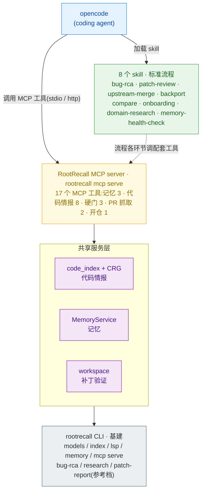

# RootRecall

> *Light on every root cause.*

**给系统软件代码库(C 为主,如 wpa_supplicant / bluez)做「带记忆的 bug 根因定位 + 深度调研」的领域 harness —— 记忆 + 代码情报 + 日志取证 + 补丁验证 + 标准流程 skill,作为 MCP tool/skill server 供 opencode 调用。** RootRecall 不自行调度 coding agent 执行固定管线;读码、改代码等重活由 opencode 承担,RootRecall 负责召回与组装精确上下文、提供工具和标准流程、沉淀并检索记忆。

## 能做什么:8 个 skill

按问题形态选择 skill。每个 skill 定义一套标准流程,流程各环节均有配套 MCP 工具。选择不用人工做:opencode 默认界面直接提问,agent 按路由表([AGENTS.md](AGENTS.md))自动载入对应 skill:

| 问题形态 | skill | 产出 |
|---|---|---|
| "为什么 X 会断 / 泄漏 / 死锁",查 bug / 崩溃 / 回归 / CVE 根因 | `bug-rca` | 根因 + 补丁(已验 apply)+ 分析报告 + 沉淀教训 |
| "这个补丁干啥 / 能不能打上 / 该不该合" | `patch-review` | 补丁或 GitHub PR 鉴定:做了什么、能否 apply、影响面、合入建议 |
| "上游这些 commit 哪些该合 / 哪些已经修过" | `upstream-merge` | 逐 commit 三态判定(fork 已修 / 建议合 / 冲突大)+ 相关性 + 报告 |
| "v25 修了这个 bug,v20 还没修,帮我改 v20" | `backport` | 读 v25 的 fix → 语义判断 v20 是否存在同一缺陷 → 适配出 v20 补丁(已验 apply) |
| "v20、v25 在连接流程上有什么差异" | `compare` | 锚定两版流程入口,逐节点读函数体对照,输出流程级差异报告 |
| "这个仓库整体架构怎么组织 / 新人怎么上手" | `onboarding` | 结构图俯瞰模块边界 + 沿一条真实用户旅程端到端走读,输出导览报告 |
| "蓝牙协议是怎么设计的 / 帮我记个技术笔记" | `domain-research` | 联网检索权威源交叉印证,把领域知识写入记忆(后续 recall 自动带出) |
| "记忆库质量怎么样 / 这个仓都记了些啥" | `memory-health-check` | 全量记忆逐条审计(溯源 / 置信度 / 时效 / 矛盾),输出健康信号与建议 |

易混问题的判据(upstream-merge vs backport、compare vs backport 等)见 [docs/skill-routing-matrix.md](docs/skill-routing-matrix.md)。

8 个 skill 构建在三项共享能力之上:**代码情报**(结构图 + 向量索引 + 调用链)、**记忆**(带溯源、可纠正、持续学习的知识库)、**标准流程**(skill + 工具 + 硬门)。三者共享同一个 MCP server,任何 agent 均可使用。

## 快速开始

前置:[opencode](https://opencode.ai) 已安装并完成过一次默认模型配置(RootRecall 的 agent block 不钉模型,继承默认);两个 API key —— [DeepSeek](https://platform.deepseek.com)(LLM)+ [DashScope](https://bailian.console.aliyun.com)(embedding / reranker)。暂时没有 embedding key 也能跑**最小模式**(记忆 + 仓库管理可用,检索类等补 key),阶梯见 [configuration.md](docs/configuration.md)「最小模式」。

密钥清单(quickstart 交互式写入 `.env`,只做非空检查、永不回显;opencode 自身的模型登录是另一回事,见其官方文档):

| key | 用在哪 | 申请处 | 可缺吗 |
|---|---|---|---|
| `DEEPSEEK_API_KEY` | LLM(模型工厂主力 provider) | [platform.deepseek.com](https://platform.deepseek.com) | 建议必配(备选 provider 已在 config.yaml 预置,换 `OPENAI_API_KEY` 等即可) |
| `DASHSCOPE_API_KEY` | embedding + reranker(代码检索) | [bailian.console.aliyun.com](https://bailian.console.aliyun.com) | 可缺 → `uv sync --extra embedding-local` 切本地嵌入,或先跑最小模式 |
| `GITHUB_TOKEN` | `fetch_patch` / upstream-merge 抓 PR | [github.com/settings/tokens](https://github.com/settings/tokens) | 可缺:公开 PR 匿名可用(限速) |

(domain-research 的联网调研走 opencode 原生 websearch/webfetch,不需要额外 key。)

```bash
# uv
curl -LsSf https://astral.sh/uv/install.sh | sh

git clone https://github.com/TuNaiChao/RootRecall.git && cd RootRecall
bash scripts/quickstart.sh    # 依赖 + .env 密钥 + 模型验证 + 代码仓总目录 + 接线自检(幂等,可重跑)
```

> uv run rootrecall install --global   # 全局注册四件套(skills+MCP+agent块+AGENTS.md 路由段)→ 任意目录 opencode 免接线
>
> `install --global` **通常不用单独跑**:quickstart 第 [6/7] 步答 y(默认回车)时已自动执行同一条命令。单独跑它只在三种场景:当时答了 n、quickstart 时 opencode 还没装好、或 `git pull` 升级后想同步刷新四件套(幂等,重跑无害)。但这一步的效果**不可跳过** —— 四件套没装进 `~/.config/opencode/`,RootRecall 就只在仓库根目录启动时生效,任意目录问话不会路由;装没装好用 `opencode mcp list`(任意目录跑)看 `rootrecall ✓ connected` 即知。

日常命令(quickstart 之外,`--help` 只列这些;进阶命令隐藏不删,全量见 [cli.md](docs/cli.md)):

```bash
# ── 基线一条龙:把源码 git clone 进总目录(quickstart 建,默认 ~/codebases)后,每仓一条 ──
uv run rootrecall baseline add ~/codebases/v20/bluez      # 登记 baseline(git url/branch 自动读)+ 建索引
                                                           # 默认名=路径倒序连 '-':v20/bluez→bluez-v20;systemd→systemd
uv run rootrecall baseline add ~/codebases/v25/bluez      # → bluez-v25(upstream/bluez 同理)
uv run rootrecall baseline ls                             # 看全部基线/检出
uv run rootrecall baseline sync                           # 同步全部基线:fetch→ff→增量刷索引(缺省=全部;systemd 样例见 deploy/)
uv run rootrecall baseline checkout bug-001 --from bluez-v20 --ref 5.50.58-deepin1 --bug 001 --index
                                                           # 秒取指定版本检出(worktree+播种索引,登记 ephemeral;不脏基线)

# ── opencode 接线(全局一次 + bug 目录标记)───────────────────────────────
uv run rootrecall install --global   # 全机一次:skills 软链 + MCP 注册 + agent 块 + AGENTS.md 路由段
uv run rootrecall here --codebase <索引名>   # bug 目录轻标记(默认检索库);之后该目录 `opencode` 直接问
bash scripts/wire_opencode.sh <工作仓> --codebase <索引名>   # 项目级备选(不想全局注入 / 无权写 ~/.config)
```

bug 定位时不用手动 checkout:在 opencode 里说「bluez **5.50.58-deepin1** 的 XX 问题」,agent 会 `find_repo` 查注册表、未命中自动跑上面的 baseline checkout 开检出仓再分析。

| 环境变量 | 作用 |
|---|---|
| `ROOTRECALL_MCP_TOOLS` | 裁剪工具面省上下文:`minimal`(8 个)/ `research` / `full`(17 个,默认)或逗号清单;未注册的工具不进 tools/list |
| `ROOTRECALL_HOME` | 数据落点整体迁出安装根(如 `~/.local/share/rootrecall`):索引/记忆/镜像/注册表/报告全跟走,`git pull` 升级不碰数据;不设 = 现状不变。详见 [configuration.md](docs/configuration.md) |
| `ROOTRECALL_CODEBASES` | 代码仓总目录(quickstart 建,默认 `~/codebases`):`baseline add` 按其下相对路径自动命名 |
| `ROOTRECALL_CLAUDE_LINK=0` | 跳过 Claude Code 记忆软链(只用 opencode 的机器) |

## 使用

opencode 启动位置三选一:**本仓库根**(默认)、**已接线的工作仓**(wire_opencode.sh / `rootrecall here`)、**任意目录**(`install --global` 注册后免接线);停在默认界面直接提问即可,agent 读 [AGENTS.md](AGENTS.md) 路由表自动载入对应 skill(`rootrecall-*` 模式已撤出 Tab 切换列表,改为 subagent 供 `@` 点名或硬门隔离时委派)。全局注册把 skills 软链进 `~/.config/opencode/skills/`、MCP 写进 `~/.config/opencode/opencode.json`(cwd 锚回本仓)、路由表以标记段落进 `~/.config/opencode/AGENTS.md`——卸载 `install --global --uninstall` 只摘自己写的。项目级接线时 `.claude/skills`/`AGENTS.md` 软链供项目级发现,生成的 `opencode.json` 经 `mcp.rootrecall.cwd` 把 MCP 进程锚回本仓,`.venv` / `data/` / `.env` 照旧解析。

**仓库注册表**(`data/repos.yaml`,由 `baseline add/checkout`、`ensure_repo` 自动维护)把「索引名↔仓库路径↔角色↔生命周期」串起来:检索/记忆类工具与 `validate_patch` 等的 `repo_path` 参数现在**直接吃注册名**(注册表→索引清单→data/repos 逐级反查),compare/bug-rca 等不再问你要绝对路径;`baseline ls` 一眼看全机资产,baseline(共享基线,`baseline sync` 定时更新,systemd timer 样例见 [deploy/](deploy/))与 ephemeral(一次性 bug 检出,`repo gc --dry-run` 先看后删)各安其位。

试用(默认界面直接问,自动路由):

- 「为什么 wpa 的 P2P 会话会泄漏?」→ `bug-rca`
- 「这个仓库整体架构怎么组织?新人怎么上手?」→ `onboarding`

多仓库:检索 / 记忆类工具均接受 per-call `codebase` 参数,建多个索引即可切换;记忆全局共享,按 codebase 标签隔离。命名约定:索引名用「项目-版本线」(`wpa-v25`),记忆标签用项目名(`wpa`)—— 教训跨版本共享,防版本孤岛。

更新:`git pull` 后重跑 quickstart(幂等);基线仓打进补丁/上游有新提交后跑 `baseline sync`(或对检出重跑 `baseline add` 同名增量刷)—— 向量与结构图均增量更新,`--force` 才全量重建。

## 架构



一个 MCP server、8 个 skill、17 个工具。RootRecall 不替代 opencode,只提供工具与流程。

## 17 个 MCP 工具

**记忆(3 个)**

| 工具 | 作用 |
|---|---|
| `rootrecall_memory_recall` | 检索长期记忆(bug 教训 / 代码事实 / 领域知识),带 file:line 溯源,多路召回 + 时间衰减 |
| `rootrecall_memory_memorize` | 写入记忆 / 沉淀教训;支持 `corrects` 显式声明"纠正了哪条旧结论",`verification` 声明验证档(apply 过即可早记但标 unverified,真机后升级) |
| `rootrecall_memory_dump` | 全量记忆分页导出为溯源卡,供体检 / 审计(只读) |

**代码情报(8 个)**

| 工具 | 作用 |
|---|---|
| `rootrecall_search_codebase` | 语义 + 符号检索,**只返回索引中真实存在的符号**(防幻觉) |
| `rootrecall_blast_radius` | 改动影响面(结构图 BFS:改这些文件会波及谁) |
| `rootrecall_call_chain` | 调用链:谁调它 / 它调谁(N 跳 CALL 边 + PageRank 排序) |
| `rootrecall_repo_map` | 全仓符号地图,按重要性打包进 token 预算(Aider 式 repo map) |
| `rootrecall_repo_overview` | 架构俯瞰:模块社区 / 边界 / 枢纽 / 桥节点 / 耦合告警(纯图查询,防幻觉) |
| `rootrecall_cross_version_diff` | 同一个仓两个 git ref 之间的差异 |
| `rootrecall_when_introduced` | 某个符号由哪个 commit 引入(pickaxe + 行历史双锚点) |
| `rootrecall_merge_eval` | 上游 commit 合入判定三态:fork 已修(patch-id)/ 建议合 / 冲突(merge-tree,零 touch) |

**硬门(交付关卡,3 个)**

| 工具 | 作用 |
|---|---|
| `rootrecall_validate_patch` | 补丁能否干净 apply(`git apply --check`,执行硬门) |
| `rootrecall_export_patch` | 把补丁落盘成 `data/bug_rca/<repo>.patch`(交付硬门,**用户开口才调**——迭代中间版不自动落;空 diff 报错;quilt 仓的 `.pc/` 构建产物自动排除;检出带 bug 号时另归档一份到 `<bug号>/`) |
| `rootrecall_export_report` | 把分析报告落盘成 `data/bug_rca/<repo>-rca.md`(交付硬门,**用户开口才调**;同款 bug 号归档;可附带蒸馏一份 AGENTS.md) |

**PR 抓取(2 个)**

| 工具 | 作用 |
|---|---|
| `rootrecall_fetch_patch` | 抓取 GitHub PR 的 diff + 元数据(标题 / 正文 / 变更文件) |
| `rootrecall_ensure_repo` | 仓库名 / URL → 本地路径,本地没有则自动 clone |

**开仓(1 个)**

| 工具 | 作用 |
|---|---|
| `rootrecall_find_repo` | 「项目+版本」→ 注册表候选仓(名字直接当 repo_path 用);版本未开仓则返回自动开仓命令(worktree + 播种索引一步就绪)—— 自然语言到自动开仓的第一环 |

## 记忆:带溯源与纠正闭环的知识库

- **四类知识**:`codebase_fact`(代码事实,读码核实)/ `bug_lesson`(bug 教训,apply 过即记并标验证档)/ `mental_model`(经验法则,由高频教训巩固升级而来)/ `domain_knowledge`(领域知识,多权威源交叉印证或用户笔记)。
- **每条带溯源**:confidence、来源层级、evidence file:line、commit_sha、bi-temporal 双时间戳(结论过期不删除,标记为 STALE,历史可审计)。
- **纠正闭环**:新结论可显式声明纠正对象;被纠正条目降权但不隐藏,误诊记录留档可审计。
- **检索与巩固**:BM25(jieba 中文分词)+ 向量(sqlite-vec ANN)+ RRF 融合 + 时间衰减;高频条目自动巩固。

## 验证边界

系统软件的编译 / 测试 / 复现环境重、信号歧义大,RootRecall 的自动化验证**封顶在 apply**(Tier 0:补丁能在干净工作树上打上)。编译、跑测试、复现一律不做,由真机环境上的工程师完成。补丁在干净 apply 且经真机验证之前,报告只陈述推理结论,不标 tested / verified。记忆分两档:`apply_only`(apply 过即可记,但条目自动打 `unverified` 标、置信封顶 0.5,recall 渲染带「(未真机验证)」)与 `real_machine`(真机验证通过后**同一补丁重提一次**即合并升级、洗掉 unverified 标)—— 教训不憋着,但没坐实的永远看得出来。

## 文档

- **项目介绍**(功能 / 特色 / 关键技术实现,对外讲解版):[docs/项目介绍.md](docs/项目介绍.md)
- **skill 路由矩阵**(8 个 skill 的判据 + 易混对):[docs/skill-routing-matrix.md](docs/skill-routing-matrix.md)
- **三支柱模块分析**:bug 定位 [docs/bug-rca-module-analysis.md](docs/bug-rca-module-analysis.md) · 代码调研 [docs/code-research-module-analysis.md](docs/code-research-module-analysis.md) · 记忆 [docs/memory-module-analysis.md](docs/memory-module-analysis.md)
- **参考文档**:MCP 工具 [docs/mcp-tools.md](docs/mcp-tools.md) · 配置 [docs/configuration.md](docs/configuration.md) · CLI [docs/cli.md](docs/cli.md) · MCP 使用与设置(小白版)[docs/mcp-guide.md](docs/mcp-guide.md)
- **踩坑记录**:开发/设计类(编号 #N,面试讲述版)[docs/踩坑记录.md](docs/踩坑记录.md) · 测试过程类(环境/API/agent 行为,编号 TN)[docs/测试踩坑记录.md](docs/测试踩坑记录.md)
- **外部调研**:Multica 源码分析与接入方案(把本设备纳管为节点、远程派活)[docs/research/multica/README.md](docs/research/multica/README.md)
- **工作约定 + 仓库地图 + 命令**:仓库根 [CLAUDE.md](CLAUDE.md)

## 技术栈

Python 3.12 · uv 管理依赖 · LangGraph + LangChain · **mcp** SDK(MCP server,stdio + streamable-http)· tree-sitter(多语言 parser)+ clangd LSP(精确导航)+ CRG(代码结构图)+ LanceDB(code_index 向量)· **native 记忆后端**(SQLite + FTS5 + jieba 中文分词 + sqlite-vec 向量 ANN;mem0 / cognee 可换)· 多 provider 模型工厂(反射加载,加 provider 通常零代码,只改 [config/config.yaml](config/config.yaml))。

## 现状

三支柱全部落地:17 个 MCP 工具、8 个 skill 均经 opencode 真机 e2e 验证(含 wpa / bluez / sdp 真仓真数据);部署侧 quickstart 经干净机演练(零 key / 全功能两轮),systemd 定时同步(sync 每日 + gc 每周一)样例见 [deploy/](deploy/) 且已真机上线;[example/](example/) 留有 demo1 / demo2 金标准(输入 wpa 漏洞报告 + 日志 → 补丁 + 报告)。早期的 orchestrator 型 workflow(`bug-rca` / `research` / `patch-report` CLI)已被 skill + 工具路线取代并从 CLI 移除(workflow 模块留仓内作参考);CLI 日常面收敛为 `baseline` 命令族,进阶命令隐藏不删。全量 pytest 绿(362)。验证体系全部使用**私有真机金标**(自建 bug + 上游修复逐点对照),不经公开基准 —— 避开基准记忆污染(SOTA 模型只看 issue 文本即可 76% 命中出错文件,The SWE-Bench Illusion, arXiv:2506.12286),证据链的可信度以此为本。
